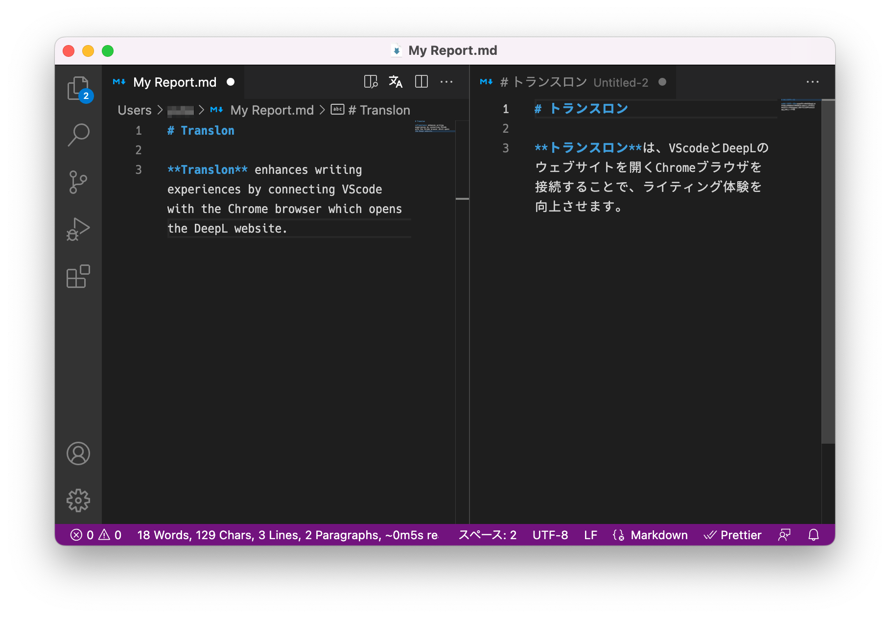

# Translon

> VSCode用のリアルタイム翻訳ツール

  

Translonは、DeepLの翻訳サイトをブラウザで開き、自動入力を行うことでVSCode上でのリアルタイム翻訳を行う拡張機能です。

プレーンテキストまたはMarkdownファイルを開き、ツールバー上の翻訳ボタンをクリックするだけで使用できます。

APIの設定をする必要はありません。

## 機能

- プレーンテキスト、Markdownのリアルタイム翻訳

## 必要要件

- Microsoft EdgeまたはGoogle Chromeがインストール済みであること

## 使用方法

1. プレーンテキストもしくはMarkdownファイルを開く
2. 上部バーの`文/A`ボタンをクリック 自動でブラウザが起動し、DeepLのサイトが開かれます。
3. 文章を入力すると、リアルタイムで翻訳されます。
4. その他のDeepLの機能を使用する場合は、ブラウザのウィンドウを直接操作してください。

## 設定

### Browser Distribution Channel

翻訳サイトを開くブラウザをMicrosoft Edge、Google Chromeの中から選択可能です。（選択したものがPCにインストールされている必要があります。）

デフォルトではMicrosoft Edgeに設定されています。

### Use Headless Browser

GUIブラウザの代わりにヘッドレスブラウザを使うかどうかを選択できます。

ヘッドレスブラウザを使用する場合、ブラウザウィンドウは表示されませんが、複雑な操作はできなくなります。

## プライバシー

この拡張機能が入力されたデータを収集することはありません。

ただし、入力したデータはご使用の翻訳サイトへ送信されます。

各サイトの利用規約については、以下のページをご参照ください。

- [DeepL Translator - Terms and conditions](https://www.deepl.com/pro-license?tab=free)